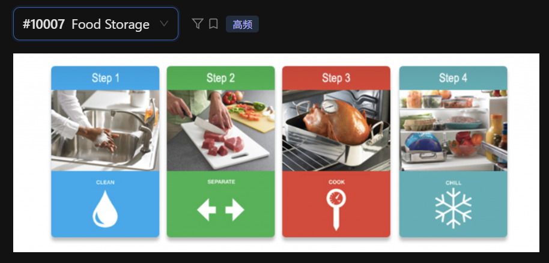

The following flow chart illustrates the four essential steps for food safety and storage.

First, according to Step 1, it is crucial to clean your hands and surfaces frequently, as indicated by the water drop icon. Next, Step 2 emphasizes the importance of separating raw meats from other foods to avoid cross-contamination.

Moving to Step 3, the image shows that food must be cooked to the right temperature, using a thermometer for accuracy. Finally, Step 4 suggests that we should chill food promptly in the refrigerator to keep it fresh and safe for consumption.

In conclusion, following these four steps—clean, separate, cook, and chill—is vital for maintaining food hygiene and preventing illness.

## 重点词汇与发音提醒
 - Hygiene: /ˈhaɪdʒiːn/ (卫生) —— 总结时的地道词汇。

 - Cross-contamination: /ˌkrɔːs kənˌtæmɪˈneɪʃn/ (交叉污染) —— 描述 Step 2 的核心专业术语。

 - Thermometer: /θərˈmɑːmɪtər/ (温度计) —— 描述 Step 3 画面细节的高分词。

 - Promptly: /ˈprɑːmptli/ (迅速地) —— 描述 Step 4 放入冰箱的动作。

## 答题建议：
 - 利用下方关键词： 这种图最棒的地方在于它直接给了你四个动词（Clean, Separate, Cook, Chill）。在口语中，一定要重读这四个词，这能显著提高你的关键词匹配分。

 - 描述图标： 如果时间充裕，可以顺便提一下底部的图标，比如 "the snowflake icon for chilling" 或 "the thermometer icon for cooking"。

 - 逻辑连贯： 使用 "First, Next, Moving to, Finally" 这种连接词，会让机器认为你的逻辑非常严密。