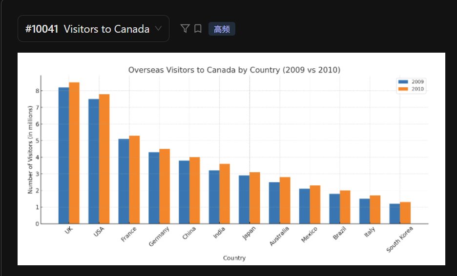

The bar chart illustrates the number of overseas visitors to Canada from different countries in 2009 and 2010.

According to the graph, the UK was the largest source of visitors in both years, with the **number peaking at** nearly 9 million in 2010. This is followed by the USA and France, which also **contributed** a significant number of tourists.

**In contrast**, South Korea and Italy had the lowest number of visitors, with **figures staying below 2 million**. **It is worth noting** that every country listed **showed a slight increase** in visitor numbers from 2009 to 2010.

In conclusion, the UK remained the most dominant market for Canadian tourism, while the overall trend for international visits was upward across all represented nations.

 - 年份 2009/2010：two thousand (and) nine/ten; 2010之后可以用两段式 twenty ten

 - 关键词覆盖： 确保读到了标题、坐标轴单位、最高和最低国家的名称。

 - 万用结论： 如果最后时间快到了，直接说 "In conclusion, the data provides a clear comparison of ****." 即可。