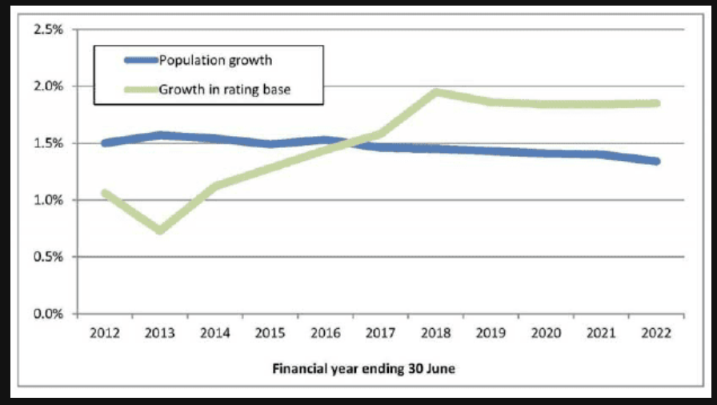

The line graph illustrates the comparison between population growth and the growth in rating base from 2012 to 2022.

According to the graph, the population growth, represented by the blue line, remained relatively stable, starting at 1.5 percent and slightly decreasing to around 1.3 percent by the end of the period.

In contrast, the growth in rating base, shown by the green line, experienced significant fluctuations. It hit a low point of 0.7 percent in 2013 but then showed a strong upward trend. Notably, it surpassed the population growth line around 2017 and reached its peak at nearly 2.0 percent in 2018.

In conclusion, while population growth showed a steady decline, the growth in the rating base saw a dramatic increase and remained higher than population growth after 2017.

## 重点词汇与语法分析
 - Fluctuations: /ˈflʌktʃuˈeɪʃnz/ (波动) —— 用来形容绿色线非常合适。

 - Surpass: /sərˈpæs/ (超过) —— 描述两条线交叉时的核心高分词汇。

 - Relatively stable: (相对稳定) —— 形容蓝色线的最佳表达。

 - Financial year: /ˈfaɪnænʃl jɪr/ (财政年度) —— 读横轴名称时用到。

## 备考建议：
 - 描述交叉点： 在 PTE DI 中，如果两根线交叉了，一定要提到交叉的时间点（例如 "around 2017"），这能向系统证明你读懂了图表的核心逻辑。

 - 数字的精度： 纵轴的刻度很细（0.5%一跳），读数时用 "around" 或 "approximately" 即可，不要纠结是 1.3 还是 1.35。

 - 年份连读： 2012 to 2022 读作 "Twenty-twelve to twenty-twenty-two"。