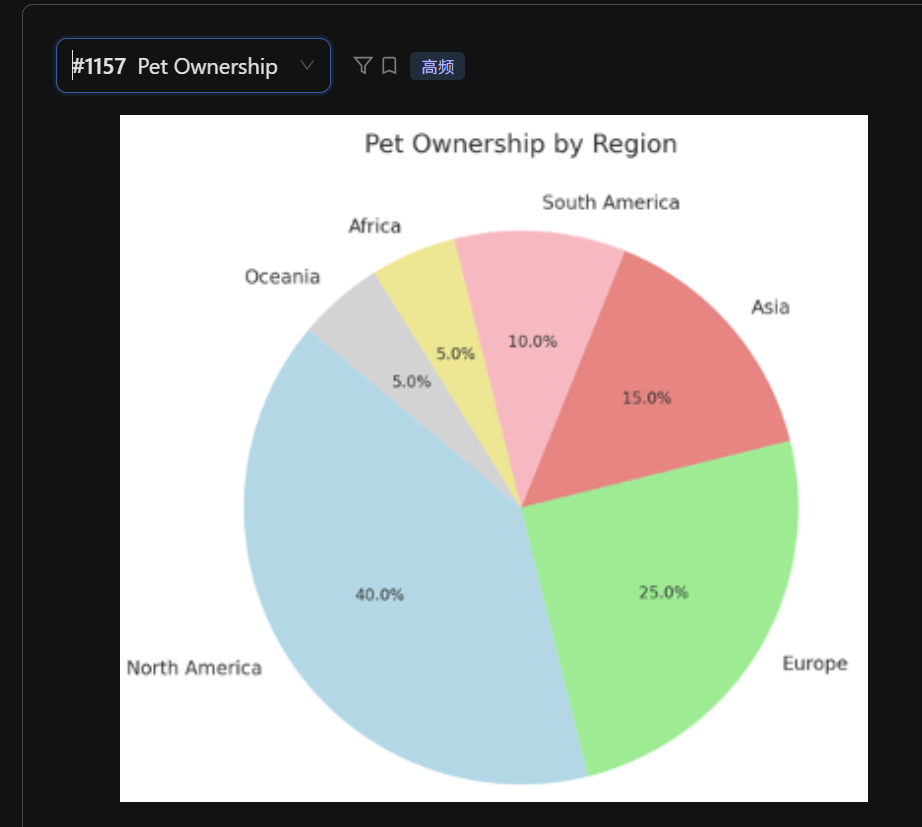

**核心数据点**
 - 标题： Pet Ownership by Region

 - 最大占比： North America (40.0%)

 - 第二大占比： Europe (25.0%)

 - 中间占比： Asia (15.0%) 和 South America (10.0%)

 - 最小占比： Africa (5.0%) 和 Oceania (5.0%)

The pie chart **describes the distribution** of pet ownership across different regions of the world.

According to the graph, North America holds the largest share, **accounting for 40 percent** of the total pet ownership. This is followed by Europe, which represents 25 percent of the chart.

**On the other hand,** Asia and South America contribute 15 percent and 10 percent **respectively**. It is interesting to note that Africa and Oceania have the smallest proportions, **with each region accounting for only 5 percent.**

In conclusion, the majority of pet ownership is concentrated in North America and Europe, while Oceania and Africa represent the smallest markets.

## 重点词汇与发音提醒
 - North America: /ˌnɔːrθ əˈmerɪkə/ (注意 th 的发音)

 - Oceania: /ˌoʊʃiˈæniə/ (大洋洲，注意发音)

 - Percent: 读数字时，40.0% 直接读 "forty percent" 即可，不需要读 "point zero"。

 - Distribution: /ˌdɪstrɪˈbjuːʃn/ (分布)

## 小建议
对于这种数值非常整齐（如 5%, 10%, 15%）的饼状图，你的流利度（Fluency）是拿分的关键。如果遇到 Oceania 这种单词觉得卡壳，可以快速跳过或者读成 "the rest of the regions"，保证声音不停顿比读准每一个单词更重要。