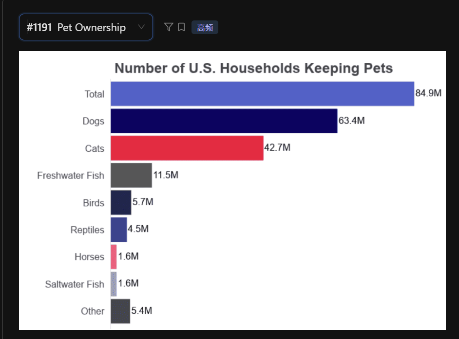

这张图是一个典型的横向柱状图（Horizontal Bar Chart），描述了美国养宠物家庭的数量分布。这类图表的答题逻辑非常清晰：总数 -> 最大项 -> 最小项 -> 总结。

核心数据提取
标题： Number of U.S. Households Keeping Pets

单位： M (Million，百万)

总数（Total）： 84.9M

最高项： Dogs (63.4M)

第二高： Cats (42.7M)

最低项： Horses 和 Saltwater Fish (均为 1.6M)

The **horizontal bar chart** provides information regarding the number of U.S. households keeping different types of pets.

According to the graph, the total number of households with pets is 84.9 million. Among all categories, Dogs are the most popular pet, being kept by 63.4 million households. This is followed by Cats, **which account for** 42.7 million households.

In contrast, Horses and Saltwater Fish are the least common, with both categories standing at only 1.6 million. Other animals like Freshwater Fish and Birds also represent** a smaller portion **of the total.

In conclusion, dogs and cats are the dominant pets in the United States, while horses and saltwater fish are** much less common **among American households.

## 重点单词发音与注意事项
 - Households: /ˈhaʊshoʊldz/ (家庭) —— 这个词在 PTE 考题中经常出现，建议练熟。

 - Freshwater Fish: /ˈfreʃwɔːtər fɪʃ/ (淡水鱼)

 - Saltwater Fish: /ˈsɔːltwɔːtər fɪʃ/ (咸水鱼/海鱼)

 - Reptiles: /ˈreptaɪlz/ (爬行动物)

 - 84.9M: 读作 "Eighty-four point nine million"。

## 提分策略：
这张图的条目比较多（Total, Dogs, Cats, Birds...），**你不需要把每一个条目都读出来**。在 40 秒内，挑出最大的两个和最小的一个，中间的用 "Other categories like..." 快速带过，这样可以确保你的流利度非常高，不会因为纠结数字而卡壳。