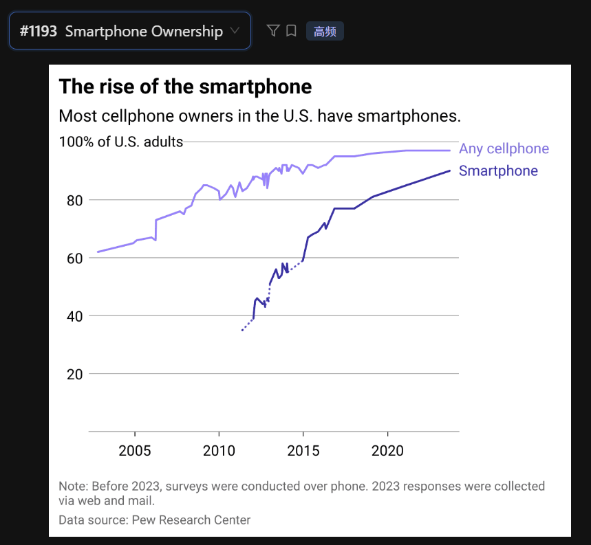

The line graph illustrates the rise of smartphone ownership among U.S. adults from before 2005 to 2023.

According to the graph, the proportion of people owning any cellphone, represented by the light purple line, started at approximately 60 percent and steadily increased to nearly 100 percent by the end of the period.

In contrast, smartphone ownership, shown by the dark blue line, began much later around 2011 at about 35 percent. However, it experienced a rapid and consistent upward trend, reaching approximately 90 percent in 2023.

In conclusion, it is clear that smartphones have become the dominant type of mobile device, making up the vast majority of total cellphone ownership in the U.S.

## 重点词汇与逻辑分析
 - Vast majority: /væst məˈdʒɔːrəti/ (绝大多数) —— 用来形容 2023 年智能手机在手机中的占比。

 - Rapid upward trend: (快速上升趋势) —— 形容深蓝色线的坡度。

 - Converge: /kənˈvɜːrdʒ/ (汇合/趋于一致) —— 如果你想拿更高分，可以说：The two lines are starting to converge as most cellphone owners now have smartphones.

 - Ownership: /ˈoʊnərʃɪp/ (拥有率)

## 提分技巧：
 - 处理折线图的波动： 你会发现浅紫色线在 2010-2015 年间有很多小锯齿（波动），在口语中不需要理会这些细节，直接用 "steadily increased" (稳步增长) 概括即可。

 - 注意虚线： 2011-2015 年间深蓝色线有一段是虚线，这通常代表数据缺失或统计方式变更，考试时可以直接跳过，只描述整体坡度。

年份读法： 2023 读作 "twenty-twenty-three"。