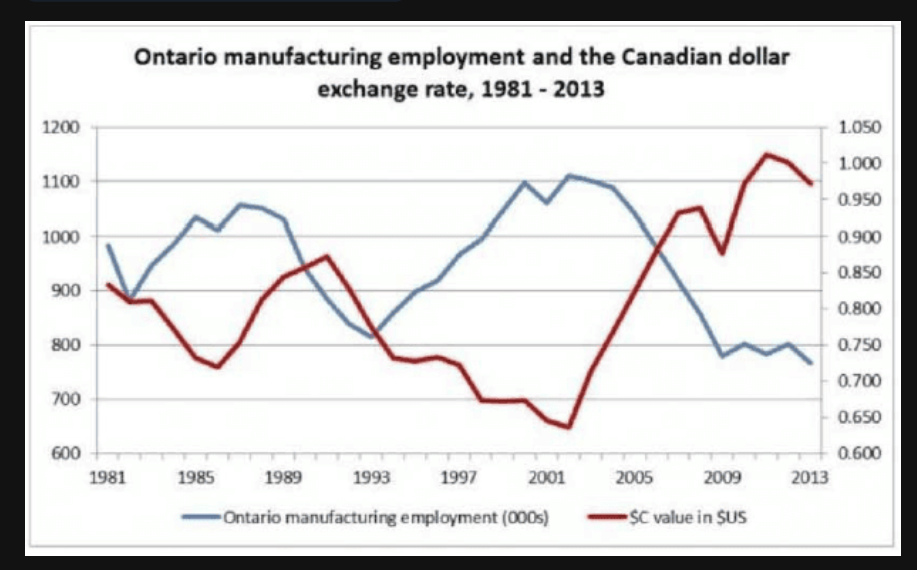

The line graph illustrates the relationship between Ontario manufacturing employment and the Canadian dollar exchange rate from 1981 to 2013.

According to the graph, the manufacturing employment, shown by the blue line, peaked at approximately 1,100 thousand in 2002 before experiencing a significant decline toward the year 2013.

In contrast, the Canadian dollar value, represented by the red line, reached its lowest point around 2002 at about 0.65 US dollars. However, it showed a sharp increase afterwards, peaking at over 1.00 around 2011.

In conclusion, there is an inverse correlation between these two variables, as employment numbers generally decreased when the Canadian dollar gained value.

## 难点突破：如何描述双轴图？
这种图表在视觉上很乱，考试时只要说清以下几点就能拿高分：

 1. 明确颜色： "The blue line represents..." 和 "The red line represents..." 是最简单的区分方式。

 1. 单位处理： * 左边的就业人数单位是 (000s)，所以 1100 读作 "eleven hundred thousand" 或 "one point one million"。

    - 右边的汇率读作 "zero point six five" 或 "one point zero"。

3. 负相关 (Negative/Inverse correlation)： 这是一个加分词汇。图中蓝色线上升时红色线往往下降，反之亦然。正相关 Positive correlation

 ## 词汇与发音提醒：
 - Exchange rate: /ɪksˈtʃeɪndʒ reɪt/ (汇率)

 - Manufacturing: /ˌmænjuˈfæktʃərɪŋ/ (制造业) —— 这是一个长词，建议多练几遍，不要在这里卡顿。

 - Fluctuate: /ˈflʌktʃueɪt/ (波动) —— 如果不想说具体的最高最低点，可以用这个词形容趋势。

 - 这个图的时间跨度很大（1981-2013），读年份时记得用我们之前练习的方法：Nineteen eighty-one to twenty thirteen。