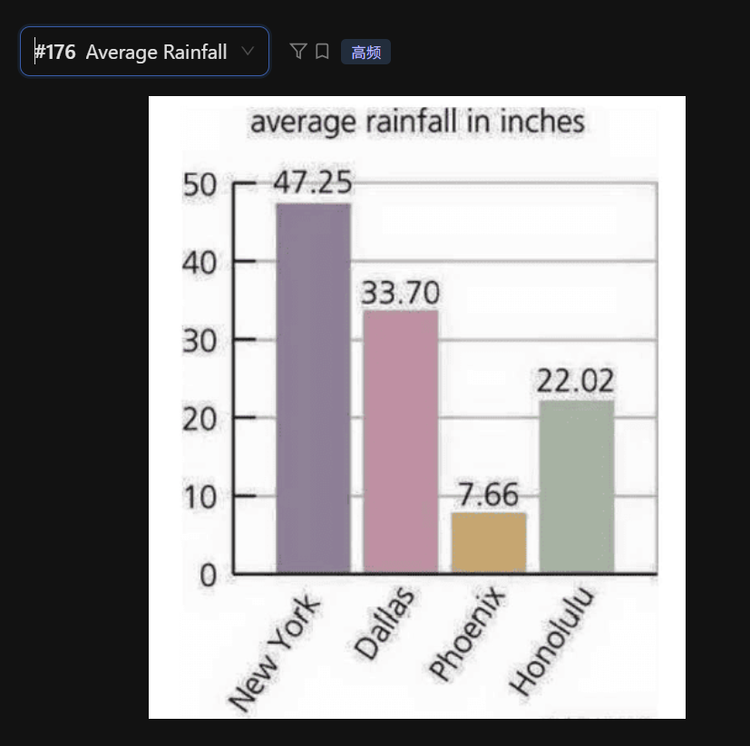

The bar chart provides information regarding the average rainfall in inches for four different cities.

According to the graph, New York has the highest average rainfall, **peaking at** forty-seven point two five inches. This is followed by Dallas, which receives thirty-three point seven zero inches of rain.

In contrast, Phoenix has the lowest amount of rainfall at only seven point six six inches. Additionally, Honolulu **stands in the middle** with a figure of twenty-two point zero two inches.

In conclusion, New York is the wettest city among the four, while Phoenix remains the driest with the least amount of precipitation.

## 在英语中，小数点（point）后面的数字要一个一个分开读：

 - 47.25: Forty-seven point two five

 - 33.70: Thirty-three point seven zero

 - 7.66: Seven point six six

 - 22.02: Twenty-two point zero two (注意 0 读作 zero 或 oh)

## 提分建议：
 - 单位（Inches）： 题目明确给出了单位是 inches，在读数字后面一定要带上这个词，这属于“关键信息”抓取。

 - 词汇替换： 如果你想拿更高分，可以用 "wettest" (最湿润的) 代替 highest，用 "driest" (最干燥的) 代替 lowest，或者用 "precipitation" (降水) 代替 rainfall。

 - 心态控制： 这种带小数点的题最容易在读数字时打结。如果卡住了，宁愿读成“接近 47” (nearly forty-seven) 也不要停下来纠结那两个小数点，流利度永远是第一位。