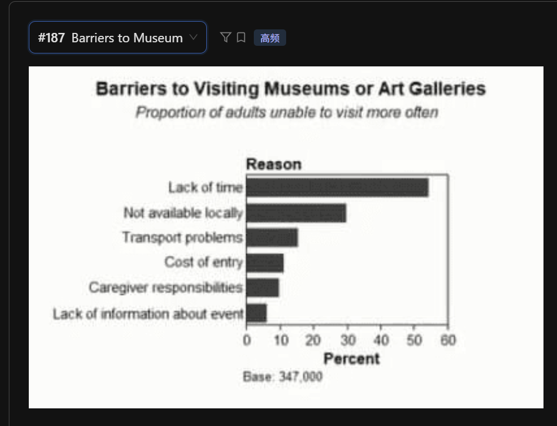

The horizontal bar chart illustrates the barriers to visiting museums or art galleries **among a group of adults.**

According to the graph, the **most significant barrier** is the lack of time, which **accounts for** more than 50 percent of the respondents. This is followed by the factor of not being available locally, **representing** approximately 30 percent.

In contrast, other reasons such as transport problems and the cost of entry show much lower proportions, staying between 10 and 15 percent. Interestingly, **the least/lowest common reason / the minimum proportion / at the bottom of the list** is the lack of information about events, which stands at only 5 percent.

In conclusion, the majority of adults are unable to visit museums more often due to time constraints and geographical limitations.

## 重点单词发音与技巧
 - Barriers: /ˈbæriərz/ (障碍) —— 标题里的核心词。

 - Approximately: /əˈprɒksɪmətli/ (大约) —— 描述那些没有给确切数字的柱子时，这个词非常好用。
-** around/roughly/about**

 - Proportions: /prəˈpɔːrʃnz/ (比例) —— 替换 percent 的高级词汇。

 - Caregiver: /ˈkerɡɪvər/ (照顾者) —— 图中提到的 "Caregiver responsibilities" 指的是需要照顾小孩或老人。