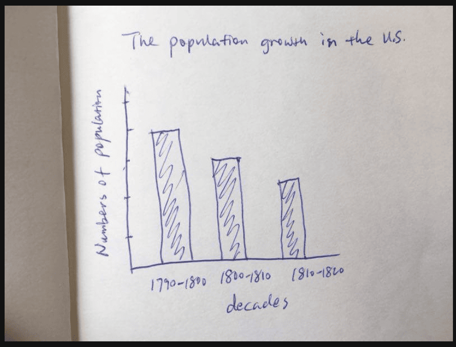

The hand-drawn bar chart provides information regarding the population growth in the United States over three different decades.

According to the graph, the highest number of population growth occurred between 1790 and 1800, representing the peak of the chart. This is followed by the period from 1800 to 1810, which shows a moderate decrease in the figures.

In contrast, the period between 1810 and 1820 recorded the lowest population growth among the three categories. Overall, it is clear that the numbers experienced a consistent decline throughout the decades shown.

In conclusion, the data suggests a slowing/**decreasing** trend in U.S. population growth during the early 19th century.

## 重点单词发音与技巧
 - Decades: /ˈdekeɪdz/ (十年/年代) —— 描述年份区间时常用的词。

 - Downward trend: (下降趋势) —— 这种阶梯式下降最简单的描述词。

 - Consistent decline: (持续下降) —— 加分短语。

## 针对手绘图的特殊策略：
 - 数字估算： 由于图中没有具体的刻度数值，你不需要编造数字（比如“5百万”）。直接描述高低关系即可，比如 "The first bar is the highest" 或 "The growth was decreasing"。

 - 年份读法： * 1790-1800: Seventeen-ninety to eighteen-hundred.

 - 1810-1820: Eighteen-ten to eighteen-twenty.

 - 保持流利度： 手绘图通常信息点较少，如果描述得太快，可以适当重复标题或总结趋势，确保说满 30-35 秒。