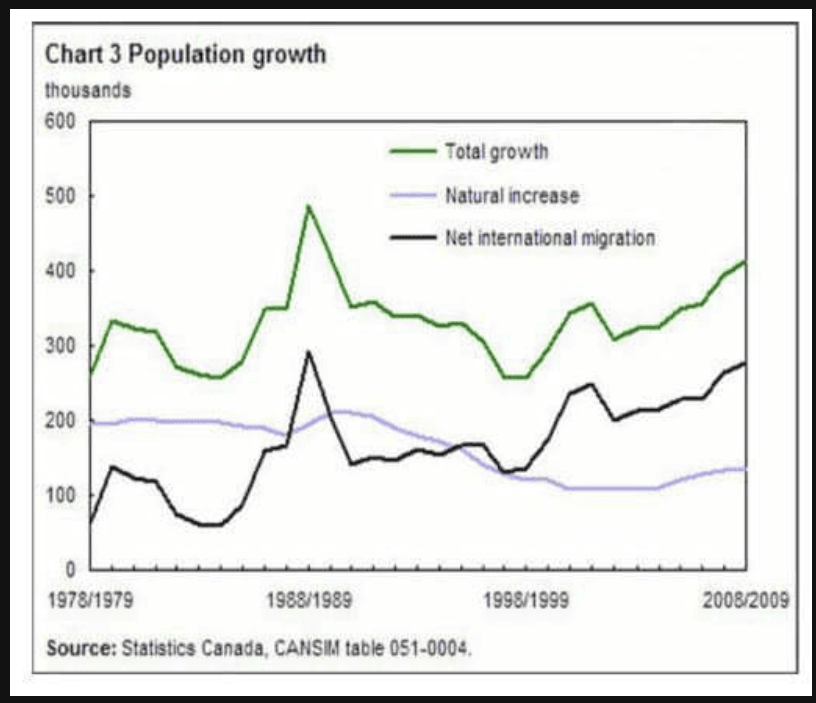

这张图（Chart 3 Population growth）是一个多线趋势图，展示了从 1978 年到 2009 年加拿大人口增长的三个组成部分。这类图表的关键在于描述总趋势以及不同变量之间的交互关系。

核心数据提取
标题： Chart 3 Population growth

单位： Thousands (千人)

绿色线 (Total growth)： 总增长，波动最大，在 1988/1989 年达到峰值（接近 500k）。

黑色线 (Net international migration)： 净国际移民，整体呈现上升趋势，且与总增长线的波动高度一致（正相关）。

紫色线 (Natural increase)： 自然增长（出生减死亡），呈现持续下降趋势，在 1998 年后降至 200k 以下。

**参考文本 (PTE 口语模版)**
The line graph illustrates the trends in population growth in Canada from 1978 to 2009, measured in thousands.

According to the graph, the total growth, represented by the green line, experienced significant fluctuations, reaching its highest point at nearly 500,000 (five hundred thousand) around 1988. This was largely driven by net international migration, shown by the black line, which also saw a sharp increase during the same period.

In contrast, the natural increase, indicated by the purple line, showed a steady and consistent downward trend over the thirty-year period, falling from 200,000 to approximately 100,000.

In conclusion, it is clear that international migration has become the primary driver of Canada's population growth, while the contribution from natural increase has gradually diminished.

## 重点词汇与逻辑分析
 - Primary driver: /ˈpraɪmeri ˈdraɪvər/ (主要驱动力) —— 用来形容黑色线对绿色线的影响非常高级。

 - Diminished: /dɪˈmɪnɪʃt/ (减少/削弱) —— 替换 "decreased" 的好词。

 - Fluctuations: (波动) —— 形容总增长线不规则的起伏。

 - Positive correlation: (正相关) —— 如果你想拿高分，可以提到：There is a strong positive correlation between total growth and international migration.

## 提分技巧：
 - 复杂年份读法： 1978/1979 这种斜杠年份，在口语中可以直接读第一个年份，或者读作 "the period of nineteen seventy-eight to seventy-nine"。

 - 关注交汇点： 注意到在 1998/1999 年左右，黑色线超过了紫色线。这是一个非常关键的转折点，说明移民贡献超过了自然增长。你可以加一句：Around 1998, net international migration surpassed natural increase for the first time.