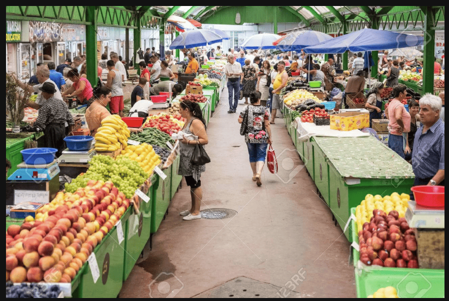

The following image illustrates a lively scene at a traditional open-air market.

In the foreground, there are rows of fresh fruits displayed on green stalls, including a large quantity of red apples, yellow bananas, and green grapes. On the right side, several blue umbrellas are set up to provide shade for the vendors and their produce.

In the background, many shoppers and vendors can be seen interacting along the narrow walkway. Some people are selecting items, while others are walking through the market under the green metal roof structure. The overall atmosphere appears very busy and colorful.

In conclusion, this picture provides a detailed depiction of a local marketplace where people gather to purchase fresh agricultural products.

## 重点词汇与发音提醒
 - Vendor: /ˈvendər/ (摊贩)

 - Produce: /ˈproʊduːs/ (这里作名词，指农产品，注意重音在第一个音节)

 - Agriculture: /ˈæɡrɪkʌltʃər/ (农业)

 - Vibrant: /ˈvaɪbrənt/ (充满活力的)

 - Stalls: /stɔːlz/ (货摊)

## 备考建议：
 - 分类描述法： 这种图中东西很多，不要一个一个数。用 "various kinds of fruits" (各种水果) 或者 "a wide range of vegetables" (琳琅满目的蔬菜) 这种概括性的词汇来节省时间并提高流利度。

 - 方位词的运用：

    - In the foreground: (前景) 描述离镜头最近的苹果和香蕉。

    - On both sides: (在两侧) 描述走道两旁的货架。

    - In the background: (背景) 描述远处的人群。

 - **流利度（Fluency）高于一切**： 即使你不知道某种水果的英文名字，直接叫它 "fruit" 即可。不要为了想 "grapes" 这个词而停顿 2 秒。