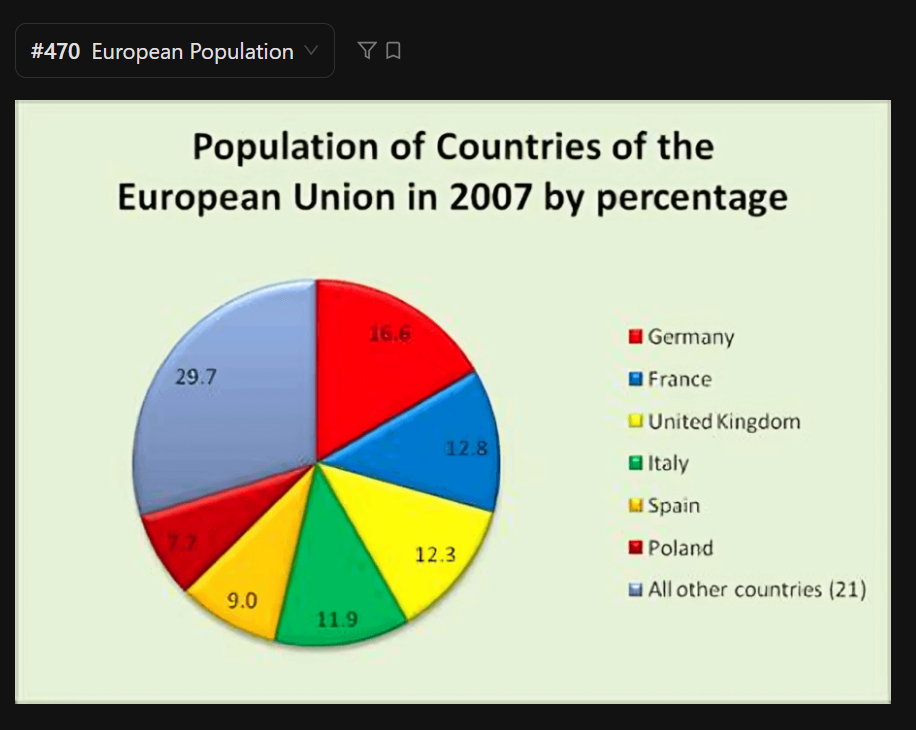

The pie chart illustrates the population of Countries of the European Union in 2007 (two thousand and seven) by percentage.

According to the graph, Germany holds the highest percentage at sixteen point six percent, followed closely by France at twelve point eight percent.

In contrast, Poland represents the smallest proportion among the listed countries, standing at only seven point seven percent. Other countries like the United Kindom, Italy, and Spain **fall in between**, ranging from nine to over twelve percent.

All other countries takes twenty nine point seven percent of the total population.

In conclusion, the data shows that while a few large nations like Germany and France dominate the population, nearly a third of the European Union's people live in the remaining twenty one smaller countries.