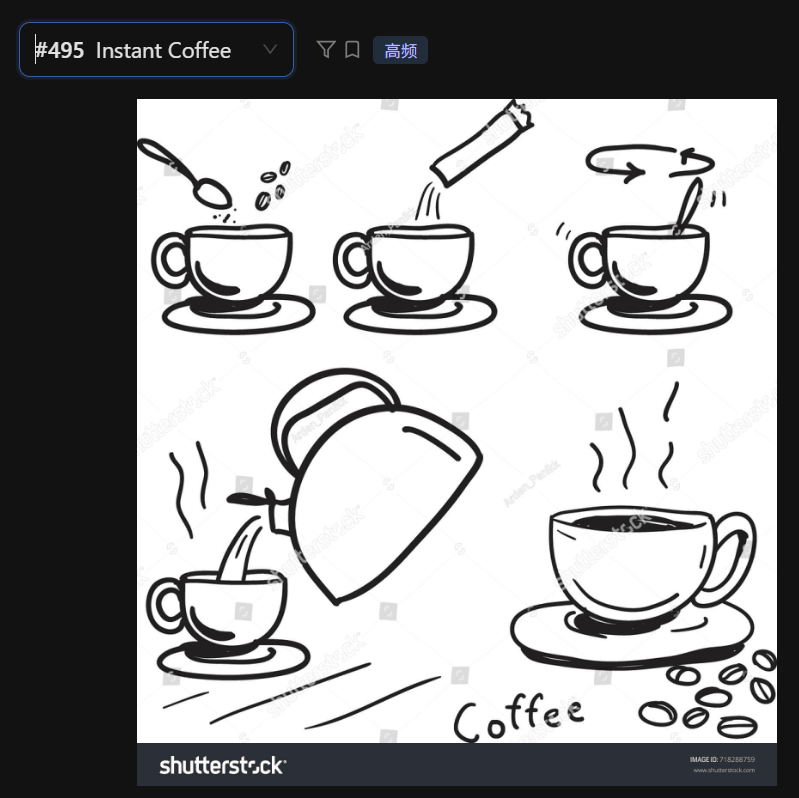

The following diagram illustrates the simple process of making a cup of instant coffee.

First, a spoonful of coffee powder is added into an empty cup. Next, a small packet of sugar or whitener is poured into the cup to add flavor.

Moving to the third step, hot water is poured from a kettle into the cup to dissolve the ingredients. Then, a spoon is used to stir the mixture in a circular motion, as indicated by the arrows. Finally, a hot and steaming cup of coffee is prepared and ready to be enjoyed.

In conclusion, the diagram provides a clear, step-by-step guide on how to prepare a quick cup of coffee using basic ingredients.

## 重点词汇与发音提醒
 - Granules: /ˈɡrænjuːlz/ (颗粒/粉末) —— 描述即溶咖啡很地道。

 - Kettle: /ˈketl/ (水壶)

 - Pour: /pɔːr/ (倾倒) —— 注意发音，不要读成 poor。

 - Stir: /stɜːr/ (搅拌)

 - Dissolve: /dɪˈzɒlv/ (溶解) —— 这是一个描述制作饮料的高分动词。

## 答题建议：
 - 使用连接词： 流程图最看重逻辑顺序。一定要多用 "Firstly," "Subsequently," "After that," 这样的词，这能显著提升你的 Enabling Skills 分数。

 - 观察箭头： 流程图中经常会有箭头（如第三幅图中的旋转箭头），一定要描述出来，比如 "stirring in a circular motion"。

 - 总结句： 哪怕图画很简单，最后也要加一句总结，比如 "In conclusion, the process is straightforward and easy to follow." 这样能让你的回答结构完整。
