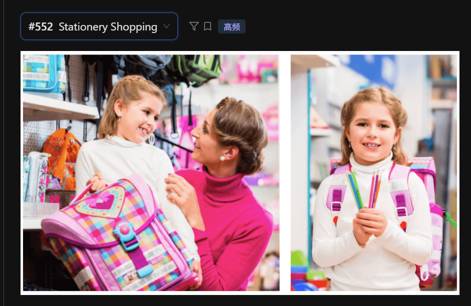

The following composite image illustrates a young girl and her mother shopping for school supplies.

In the left-hand picture, the mother and daughter are standing in front of a shelf filled with backpacks. The girl is holding a purple checkered school bag with a heart pattern, while her mother looks at her with a supportive smile. They seem to be having a joyful interaction during their shopping trip.

In the right-hand picture, the girl is shown again, now wearing the same backpack on her shoulders. She is holding several colored pencils in her hands and smiling directly at the camera. The background shows various stationery items on the shelves, creating a vibrant shopping environment.

In conclusion, these images provide a heartwarming depiction of a child preparing for school with her mother's help.

## 重点词汇与发音提醒
 - Stationery: /ˈsteɪʃənəri/ (文具) —— 注意与 stationary (静止的) 发音相同但拼写不同。

 - Checkered: /ˈtʃekərd/ (方格图案的) —— 描述那个书包样式的地道词汇。

 - Backpack / School bag: /ˈbækpæk/ (书包)

 - Heart-shaped: /hɑːrt ʃeɪpt/ (心形的)

 - Composite image: /kəmˈpɑːzət ˈɪmɪdʒ/ (组合图片) —— 开篇介绍时的高分词汇。

## 答题建议：
 - 关联描述： 这种双拼图通常有逻辑联系。你可以用 "The same backpack" 或 "The girl is shown again" 来向系统展示你观察到了两张图之间的连续性。

 - 神态描述： 实景图非常看重对氛围的描述，使用 "joyful interaction" 或 "heartwarming scene" 可以有效提升你的词汇得分。

 - 避开细节陷阱： 不要花太多时间去数后面货架上有多少个书包，重点放在人物动作（holding, wearing, smiling）上。