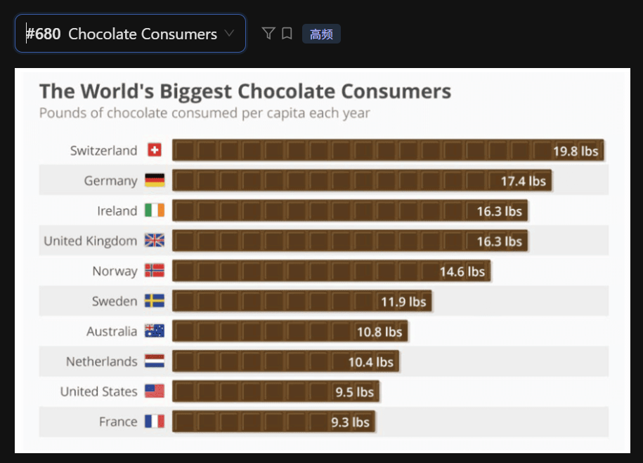

The bar chart provides information regarding the world's biggest chocolate consumers, measured in pounds per capita each year.

According to the graph, Switzerland is the leading consumer of chocolate, with an average of nineteen point eight pounds per person. This is followed by Germany, where individuals consume seventeen point four pounds annually.

In contrast, Ireland and the United Kingdom show identical consumption levels at sixteen point three pounds. Furthermore, France has the lowest consumption among the listed countries, standing at only nine point three pounds.

In conclusion, European countries, particularly Switzerland and Germany, dominate the list of the world's highest chocolate consumers.

## 重点词汇与发音提醒
 - Per capita: /pər ˈkæpɪtə/ (人均) —— 描述统计数据时的专业词汇。

 - Identical: /aɪˈdentɪkl/ (完全相同的) —— 用来描述英国和爱尔兰相同的数据，比 "the same" 更高级。

 - Lbs (Pounds): 读作 /paʊndz/，不要读成字母 L-B-S。

 - Consumption: /kənˈsʌmpʃn/ (消费/消耗量)

## 提分技巧：
 - 单位的处理： 这是一个带小数点的数字练习，记得我们之前的规则：19.8 读作 Nineteen point eight。

 - 数据分组： 如果时间不够，不需要把所有国家都念一遍。挑出最高（Switzerland）、**最低（France）以及中间的一个（如 United States, 9.5 lbs）**即可。

 - 视觉细节： 你可以顺带提一句 "The bars are represented by chocolate bars"，这虽然不加分，但能帮你填充时间并展示你的观察力。